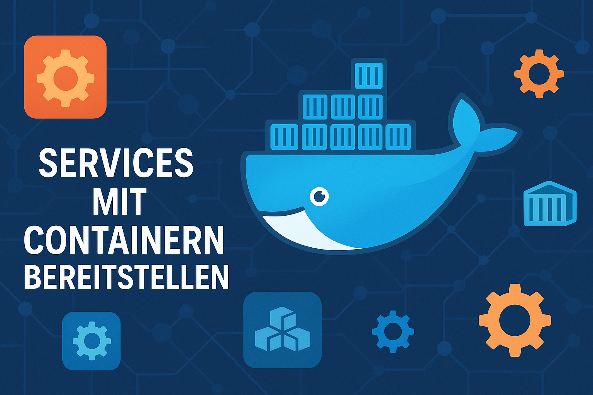

 <mark>_(Ergänzen Sie hier ihr eigenes Titelbild - Landscape, max. 1200px. Selber erstellen, im **./images** ablegen und verlinken)_</mark>

# M169 Repository

[TOC]

## Einleitung

## Kompetenznachweise
<mark>_Unterverzeichnisse für jeden Kompetenznachweis erstellen und darin wiederum ein README.md und zugehörigen Content_</mark>

- [**KN01**](./KN01/README.md)
- [**KN02**](./KN02/README.md)
- [**KN03**](./KN03/README.md)
- [**images**](/images/)

## LB2 Projekt

- [**./LB2/README.md**](./LB2/README.md) 
  - TOC 
  - Einleitung
  - Service-Beschreibung 
  - Umsetzung 
  - Anwendung 
  - Quellen 
- [**./LB2/images**](./LB2/images) 

## Reflexion
<mark>_Hier halten Sie Ihre Erkenntnisse auf der **metakognitiven Ebene** (recherchieren Sie diesen Begriff) dieses Moduls fest.
Umfang und Inhalt stehen Ihnen frei_</mark>

## Quellenverzeichnis
  * [1. Redhat über Container Orchestrierung](https://www.redhat.com/de/topics/containers/what-is-container-orchestration)
  * [2. Docker Docs](https://docs.docker.com/) 

 

---

> [⇧ **Nach oben**](#m169-repository)

___
